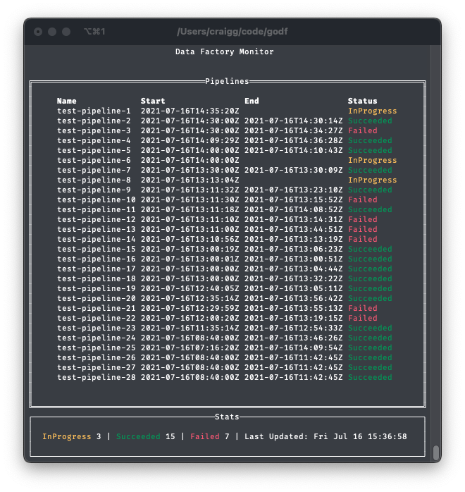

# godf

`godf` is a quick and dirty TUI application written in Go for monitoring Azure Data Factory pipeline runs.



## Environment Setup

* mac: <https://www.digitalocean.com/community/tutorials/how-to-install-go-and-set-up-a-local-programming-environment-on-macos>
* windows: TBA

## Using it

Once the environment is set up, from this repo run:

```bash
go install .
```

This will install it in to your go path.

Copy the config in to your home directory:

```bash
cp .godf ~/.godf
```

The app uses auth tokens from Azure CLI so make sure you are logged in to the right tenant.

```bash
az login --tenant xxxx
```

Now from anywhere (if you set up your environment right) you should be able to run:

```basg
godf
```